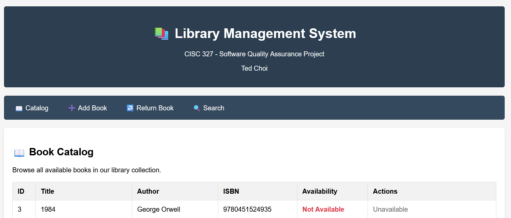

Assignment 1 — Implementation Status & Test Report

Name: Ted (Jiheon) Choi
Student ID: 20144986
Group #: N/A

1) Implementation Status (R1–R7)
Req	Function / Area	Status	Notes	Evidence
R1 Add Book	add_book_to_catalog	Partial	Valid input rejected in one path (ISBN/total_copies validation issue)	sample_test.py::test_add_book_valid_input FAIL
R2 Catalog	/catalog route	Complete	Page loads and shows book list	test_r2_catalog.py PASS
R3 Borrow	borrow_book_by_patron	Partial	Out-of-stock borrow still succeeds	test_r3_borrow.py FAIL
R4 Return	return_book_by_patron	Missing	Function not implemented	test_r4_return.py FAIL
R5 Late Fee	calculate_late_fee_for_book, /api/late_fee/...	Missing	Always returns None, policy not applied	test_r5_late_fee.py FAIL (x5)
R6 Search	search_books_in_catalog, /api/search	Missing	No matches returned, API count = 0	test_r6_search.py FAIL
R7 Patron Status	get_patron_status_report	Missing	Report missing required keys	test_r7_patron_status.py FAIL

2) Test Summary

Total tests: 16
Passed: 5
Failed: 11

Failing tests mapped to requirements:

R1: Add Book (valid add rejected)
R3: Borrow (out-of-stock borrow succeeds)
R4: Return (not implemented)
R5: Late Fee (NoneType, unimplemented)
R6: Search (empty results, API count 0)
R7: Patron Status (keys missing)

3) Unit Testing Summary
conftest.py — Flask app client + isolated temp DB fixture
test_r1_add_book.py — Add Book (R1), valid input + invalid ISBN + non-positive copies
test_r2_catalog.py — Catalog (R2), home//catalog route loads successfully
test_r3_borrow.py — Borrow (R3), succeed once then fail when out of stock
test_r4_return.py — Return (R4), borrow then return (currently fails, not implemented)
test_r5_late_fee.py — Late Fee (R5), fee calculation for multiple overdue cases (0, 3, 7, 10, 30 days)
test_r6_search.py — Search (R6), case-insensitive title search + /api/search JSON validation
test_r7_patron_status.py — Patron Status Report (R7), required keys presence check

4) Known Issues
R1: Input validation / success handling inconsistent
R3: No-stock borrow allowed
R4: Return flow unimplemented
R5: Late fee calculation unimplemented (14-day grace, tiered fees, $15 cap)
R6: Search logic/API not functional
R7: Patron status report missing required fields

5) Evidence

- Banner screenshot: 
- Pytest log: see `pytest_log.txt` [pytest_log.txt](./pytest_log.txt)

=============================================== short test summary info ===============================================
FAILED sample_test.py::test_add_book_valid_input - assert False == True
FAILED test/test_r3_borrow.py::test_r3_borrow_until_out_of_stock - AssertionError: second borrow should fail when out of stock: (True, 'Successfully borrowed "The Great Gatsby". Due ...
FAILED test/test_r4_return.py::test_r4_return_happy_path - AssertionError: return should succeed: (False, 'Book return functionality is not yet implemented.')
FAILED test/test_r5_late_fee.py::test_r5_fee_formula_via_business_logic[0-0.0] - TypeError: float() argument must be a string or a real number, not 'NoneType'
FAILED test/test_r5_late_fee.py::test_r5_fee_formula_via_business_logic[3-1.5] - TypeError: float() argument must be a string or a real number, not 'NoneType'
FAILED test/test_r5_late_fee.py::test_r5_fee_formula_via_business_logic[7-3.5] - TypeError: float() argument must be a string or a real number, not 'NoneType'
FAILED test/test_r5_late_fee.py::test_r5_fee_formula_via_business_logic[10-6.5] - TypeError: float() argument must be a string or a real number, not 'NoneType'
FAILED test/test_r5_late_fee.py::test_r5_fee_formula_via_business_logic[30-15.0] - TypeError: float() argument must be a string or a real number, not 'NoneType'
FAILED test/test_r6_search.py::test_r6_title_case_insensitive_business_logic - AssertionError: should return at least one match for sample title
FAILED test/test_r6_search.py::test_r6_api_json_search - assert 0 >= 1
FAILED test/test_r7_patron_status.py::test_r7_status_report_shape_and_keys - AssertionError: missing key in status report: borrowed_books
11 failed, 5 passed in 0.59s
