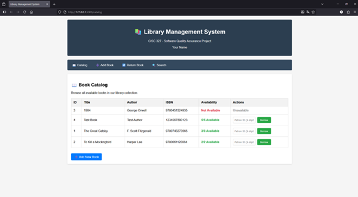

# Implementation Status

## Environment
- OS: Windows 11
- Python: 3.11
- Virtualenv used: .venv
- Packages: Flask, pytest

## Setup and Run
1. `py -m venv .venv`
2. `.\.venv\Scripts\activate.bat`
3. `pip install -r requirements.txt`
4. `python app.py`
5. Open browser at `http://127.0.0.1:5000`

## Evidence
  
Home and Catalog are the same page in this system

## What Works
- Catalog page loads and shows the book list (R2).
- Add Book works; new entry is added to the catalog (R1).
- Borrow works until all copies are checked out (R3).

## Known Issues
- Return Book does not work (R4).
- Search function does not return results (R6).
- Late Fee Calculation API not implemented(R5).
- Patron Status Report not implemented; no menu option or reporting functionality found (R7).

## Tests
- Run with `pytest`
- Coverage: `pytest --cov=. --cov-report=term-missing`
- Files:
  - `tests/test_r1_add_book.py`
  - `tests/test_r3_borrow.py`
  - `tests/test_r4_return.py`
  - `tests/test_r5_late_fee.py`
  - `tests/test_r6_search.py`
  - `tests/test_r7_patron_status.py`

## Notes
- Requirements followed from `requirements_specification.md`
- Issues above were found during quick manual test
